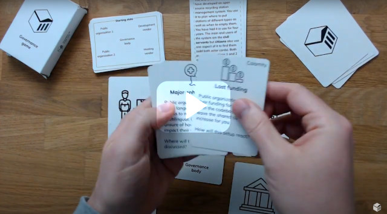
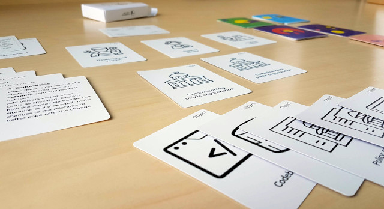

# Governance Game

[](https://www.youtube.com/watch?v=Dt0WFla4eeM)

This is an interactive game on governance of [Public Code](https://about.publiccode.net/glossary/public-code-definition.html). Use this as a way to get a conversation and reflection about governance started. We aim to use it during [early incubation of a codebase](https://about.publiccode.net/activities/codebase-stewardship/product-assets-for-early-incubation.html), or perhaps even earlier. You can of course play the game totally without our involvement, it is probably useful for any constellation that have a codebase to govern.

## Playing the game
You need a few people to play with you. There are no strict number, but you all need to be able to see and reach the cards on the table. For the actual rules, see the rules cards.



## Print your own version

Print and cut the files. Play!

## Contributing

We love when people want to help and improve the game. Please read [CONTRIBUTING](CONTRIBUTING.md) for details on our process for submitting issues and pull requests to us. Also take a look at our [Code of Conduct](CODE_OF_CONDUCT.md), we want this to be an inclusive and welcoming community.

## Roadmap

1. Do a second small scale print run of 1.0.0
2. Iterate on the cards and rules.
3. Create custom icons/imagery, [issue #3](https://github.com/publiccodenet/governance-game/issues/3)

## Versioning

We use [Semantic Versioning](http://semver.org/) for versioning. For the versions available, see the [tags on this repository](https://github.com/publiccode/govgame/tags) (and [change log](CHANGELOG.md)).

## Authors

See the list of [authors](AUTHORS.md) for who participated to this project.

## Credits
For now we are using icons from the awesome [Noun Project](https://thenounproject.com). Those icons are all under the license [CC BY](https://creativecommons.org/licenses/by/3.0/us/legalcode). Find all images used and their creators in our [Credits](CREDITS.md).

We also want to thank everyone who has played the game with us. Even if you didn't explicitly gave us feedback we learned about the game by playing with you.

## Building cards

The Makefile automatically generates a complete card deck for the Governance Game in PDF.
You can use the PDFs to print the cards yourself and cut them.
Alternatively, the PDFs are compatible with external printer companies which can print this deck.

### Dependencies

```
sudo apt install docbook-utils pandoc inkscape texlive texlive-fonts-extra \
	texlive-extra-utils
# sudo apt install texlive-full
```

The `Inter` font family is used.
To generate `.png` files, `inkscape` requires these fonts to be installed.
Download the [Inter font family](https://fonts.google.com/specimen/Inter).
Ensure that the fonts are installed in your system, for example
[Debian Installation of True Type Fonts](https://wiki.debian.org/TrueType#Installation_of_True_Type_Fonts).

### Usage

Type `make` to generate the pdf files.

Type `make view-all` to view all of the pdf files generated.

### TODO

- generate card back pdfs


## License

This project is licensed under the CC 0 License - see the [LICENSE](LICENSE.md) file for details.
